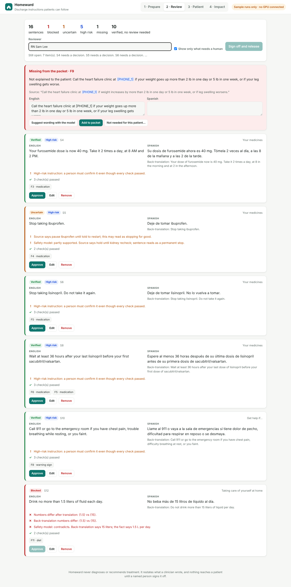

# Homeward

**Discharge instructions patients can actually follow, in their own language, with every sentence checked against the chart.**

Built for the AMD Developer Hackathon: ACT III, Health and Wellbeing track. Runs an open model on an AMD Instinct MI300X through vLLM and ROCm.



## The problem

Going home from hospital is where instructions get lost.

- Only 48% of patients could name what their medicines were for, and 56% knew what follow-up appointment they had. Patients with limited English did worse: 50% vs 66% on the appointment (Karliner et al., *Medical Care* 2012).
- Discharge notes are written at about a 10th-grade level; the AMA recommends 6th. Rewriting them more simply cut post-discharge phone calls from 22 to 9 per 100 patients (Mayo Clinic, *Am J Surg* 2016 and ACS 2017).
- Language models fix readability but are not safe unchecked: GPT-4 took discharge summaries from grade 11 to 6, yet 18% of physician reviews flagged a safety concern, with omissions in 24% and hallucinations in 4% (Zaretsky et al., *JAMA Netw Open* 2024).
- Machine translation fails where it hurts: "hold the kidney medicine" became "keep taking" it in Chinese (Khoong et al., *JAMA Intern Med* 2019).

Rewriting and translating is easy now. Making the result **trustworthy enough to hand over without re-reading everything**, and confirming the patient understood, is the gap Homeward fills. Sources and notes: [`docs/research.md`](docs/research.md).

## What it does

1. **Nurse** pastes or uploads the discharge instructions and picks the patient's language.
2. Homeward **masks identifiers**, has the model build a **fact ledger** (every instruction tied to an exact quote), writes a **grade-6 draft** where every sentence cites its facts, **translates** it, and **back-translates** it for checking.
3. **Deterministic checks** run on every sentence and a **safety model** reviews it; each sentence comes out green (verified), amber (uncertain) or red (blocked), with the reason in plain words.
4. **Reviewer** sees only what needs a human: red and amber sentences, every high-risk instruction, and anything missing. They fix, approve or remove, then sign off by name.
5. **Patient** gets a bilingual packet with read-aloud and a short **teach-back quiz**, on the ward screen or through their own private link on a phone. A wrong answer alerts the nurse to re-explain that item before the patient leaves. Once signed, the packet is locked: nothing can change it without a new sign-off.

```
 clinician text ─► mask IDs ─► fact ledger ─► plain draft ─► translate ─► back-translate
                     │            │ quote check     │ cites facts                 │
                     │            │ med-list cross- │                             ▼
                     │            │ check           └──────► per-sentence checks + safety model
                     │            ▼                                      │
                     │       coverage: every medicine, warning sign      ▼
                     │       and appointment must be told, with its   green / amber / red
                     │       dose, date or number to call                │
                     ▼                                                   ▼
            identifiers restored only in the       human review of flagged + high-risk ─► sign-off
            signed-off patient packet                                      │
                                                                           ▼
                                                   bilingual packet + teach-back ─► nurse alerts
```

## Safety, as the track asks

| Requirement | How Homeward handles it |
|---|---|
| **No autonomous diagnosis or treatment advice** | It only restates what a clinician wrote. Every sentence must cite a fact quoted from the source; a sentence with no fact behind it is blocked. A medicine not in the source is blocked. |
| **Incorrect or unsupported responses** | Facts must quote the source (fuzzy-matched); numbers in a fact must appear in its quote; the fact's kind and medicine action are re-read from the clinician's own label; a rule check adds any instruction the model left out of its ledger. Sentences are checked for numbers, units, dates, AM/PM, doses a day, "only if needed", insulin scale steps, medicine names, stop vs keep taking, invented reassurance, and invented names or contacts. A safety model gives a second verdict; a missing verdict is shown, never treated as a pass. |
| **Sensitive information** | Names (with labels in every supported language, accents, titles, kin and "Name, MD"), record and insurance numbers, SSNs, dates of birth, admission and discharge dates, phone numbers (US, UK and international), emails and addresses are replaced by placeholders before any model call, and restored only in the signed-off patient packet. A name written with no label or title can still slip through; a de-identification model as a second pass is the next step. The model is open-weight and self-hosted (for the demo, on an AMD Developer Cloud MI300X we run), so text is not sent to a third-party model API; a hospital can run the same container on its own MI300X. Staff screens show masked text and can sit behind a staff password. Cases live in memory only. |
| **Uncertain results** | Green / amber / red on every sentence, with the reason. Translation is checked in the target language itself (stop vs keep taking, units, dates, AM/PM, "only if needed", writing system) and by back-translation; disagreement shows as uncertainty, never silently. If more than 30% of translated sentences are blocked, or the language is unsupported, the packet routes to a professional interpreter. |
| **High-risk decisions** | Anticoagulants, insulin, opioids and other ISMP high-alert medicines, any stop, pause or dose change, and every warning sign are high risk. They always need a named person's sign-off, even when every check passes. A "hold" written as a plain "stop" is flagged. |
| **Human review** | Nothing reaches the patient until a named reviewer resolves every flag and signs off. Blocked sentences cannot be approved as they are, only edited or removed, and re-saving them unchanged is refused. Edited wording is checked again, an English edit marks the translation out of date, and an edited high-risk line stays in review until someone approves it. High-risk instructions from the clinician cannot be dismissed. Sign-off locks the packet. Every action goes into an audit trail. Teach-back mistakes go back to the nurse. |

## Results so far

| | Heart failure, Spanish | Knee replacement, Italian |
|---|---|---|
| Reading grade (Flesch-Kincaid), source → packet | 8.7 → 4.1 | 7.0 → 4.4 |
| Sentences | 16 | 17 |
| Verified with no human needed | 10 of 16 (63%) | 9 of 17 (53%) |
| Problems stopped | 15 L instead of 1.5 L in Spanish; ibuprofen "hold" written as "stop"; weight-gain warning left out | ibuprofen invented (patient is on enoxaparin); vague opioid wording |

These two cases replay hand-written model outputs (see below), so treat their numbers as a demonstration, not a measurement. Flesch-Kincaid understates how hard clinical shorthand is, so the source grades above are generous to the source.

**Error-injection test** ([`docs/eval-report.md`](docs/eval-report.md)): 162 errors of the kinds reported in the literature injected into correct packets; the deterministic checks alone flag all 162, with 0 false alarms on 33 clean sentences. These are synthetic mutations written alongside the checks, so treat this as a regression floor, not a real-world accuracy claim.

**Red-team test** ([`docs/redteam-report.md`](docs/redteam-report.md)): an independent tester wrote five new cases (Vietnamese, Chinese, French, Spanish) and 20 subtler errors: units, AM/PM, dates, "only if needed", omitted warnings, invented reassurance, swapped insulin scales. The first version of Homeward caught 7 and flagged 23 of 92 honest sentences. The current checks flag all 20 and 1 honest sentence. They were fixed after seeing these errors, so this is now a regression suite; a fresh held-out set is the next test.

**Real model output** ([`docs/real-runs.md`](docs/real-runs.md)): an open 3B model on a GitHub CPU runner (not AMD) dropped medicines and diet limits, labelled every fact "diagnosis", turned a STOP into "must not stop", and mixed Chinese into Vietnamese. Each of those is now flagged. A second run with the improved prompts finished all five cases; its errors (a last injection date moved from 26 to 21 October, "twice a day" translated as "a day", a dropped emergency number) are all flagged too.

**Sample runs:** the two cases above replay hand-written model outputs that reproduce error types from the studies, so the demo works without a GPU, and the app says so on screen. The Vietnamese, French and Spanish diabetes cases replay the second real 3B run, labelled "Recorded on GitHub Actions CPU runner (not AMD)", so you can review real, unscripted model output in the app. `scripts/record_samples.py` replaces them with recorded runs from the MI300X, and `scripts/benchmark.py` measures latency, throughput and cost per packet.

## AMD

- vLLM on one **AMD Instinct MI300X** (192 GB HBM3) on AMD Developer Cloud, ROCm container from the "vLLM Quick Start" image.
- 192 GB lets a 72B-parameter multilingual model (Qwen2.5-72B-Instruct) run in bf16 on a single GPU, which is what makes self-hosting realistic for a hospital: a single server it controls can run the whole pipeline.
- Five model calls per packet (facts, draft, translation, back-translation, safety review), all JSON-schema constrained. vLLM batches packets from a whole ward on the same GPU.
- Setup: [`deploy/amd/README.md`](deploy/amd/README.md).

## Run it

```bash
python -m venv .venv && . .venv/bin/activate
pip install -r requirements-dev.txt
uvicorn homeward.app:app --port 8000     # replay mode, no GPU needed
pytest                                    # 48 tests
python -m eval.mutation_eval              # error-injection report
python -m eval.redteam_eval               # red-team regression (20 injected errors on 5 new cases)
```

With the AMD endpoint:

```bash
export HOMEWARD_LLM_BASE_URL=http://<droplet-ip>:8000/v1
export HOMEWARD_LLM_API_KEY=<vllm api key>
export HOMEWARD_LLM_MODEL=Qwen/Qwen2.5-72B-Instruct
uvicorn homeward.app:app --port 8000
```

Docker: `docker build -t homeward . && docker run -p 8080:8080 homeward`.

Anywhere other people can reach it, set `HOMEWARD_STAFF_PASSWORD`: every staff page and API call then asks for it, and only the patient's own link (`/p/<token>`) stays open.

Browser walk-through of the full demo: `node tests/e2e/demo_flow.mjs http://localhost:8000` (needs Playwright).

## Layout

```
homeward/   app.py (API) · pipeline.py · verify.py (checks) · phi.py (masking) · quiz.py
            llm.py (vLLM client, replay) · prompts.py · lexicon.py · textutil.py · static/ (UI)
data/       samples/ (5 synthetic cases) · replay/ (saved model outputs) · runs/ (real model runs and their reports)
eval/       mutation_eval.py · gold_fixes.json
scripts/    record_samples.py · benchmark.py · author_*.py (scripted sample runs)
deploy/amd/ start_vllm.sh · run_app.sh
```

## Limits

Homeward is a hackathon prototype, not a medical device. All patients are synthetic. The medicine lexicon is small and English-named. Readability is measured on the English draft only. The deterministic checks cannot see meaning changes that involve no number, medicine, contact or stop/keep word; those rely on the safety model and on mandatory review of high-risk sentences. It has not been tested with patients or clinicians.

## License

MIT
